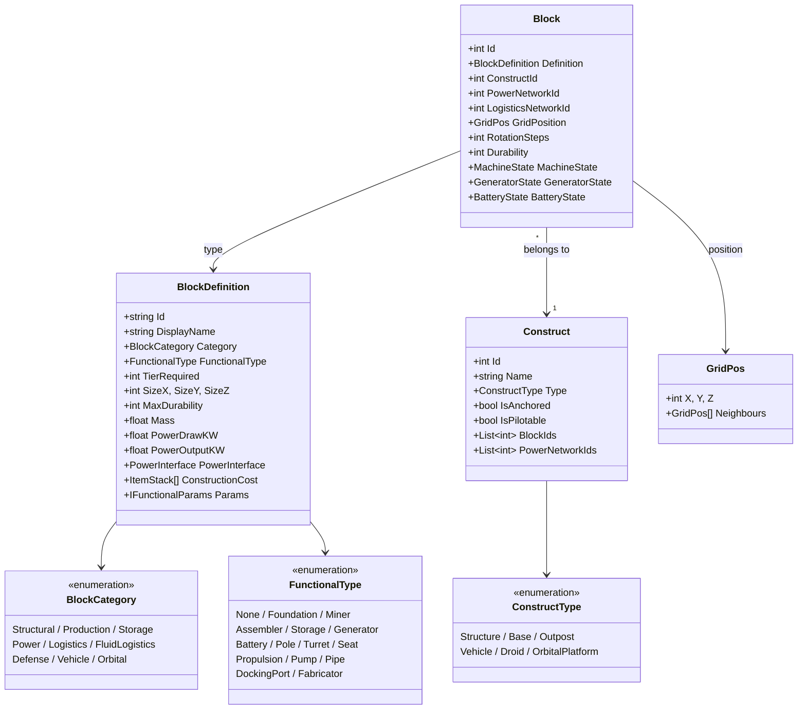
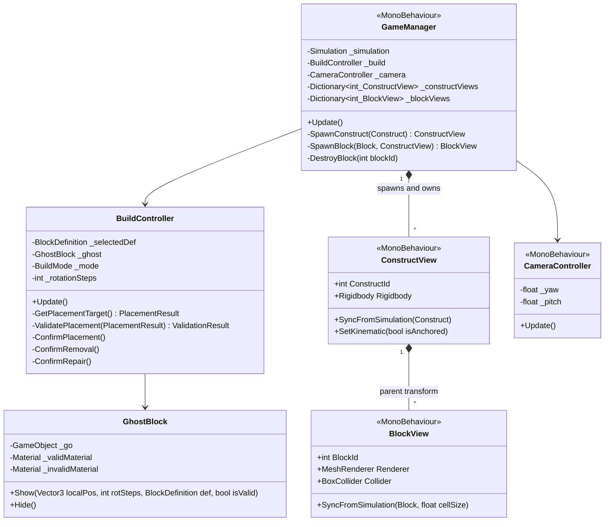
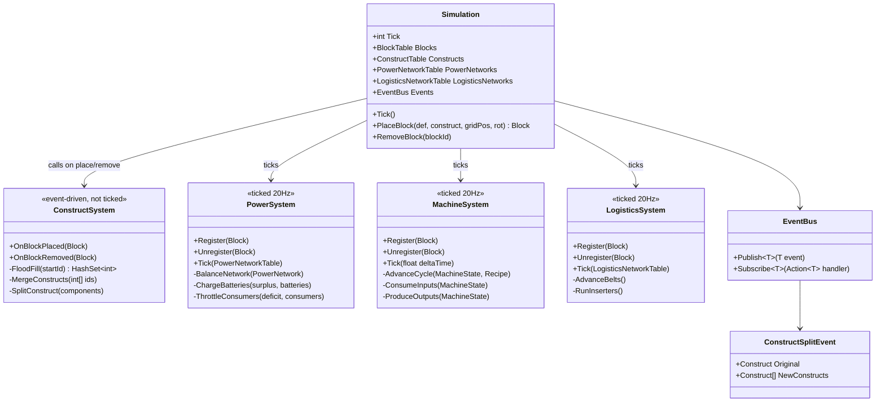
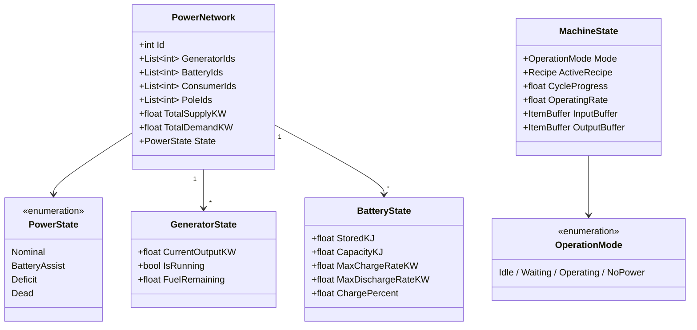
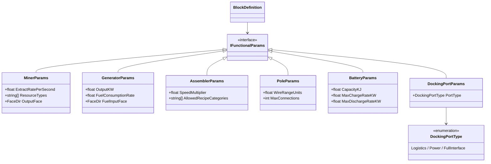
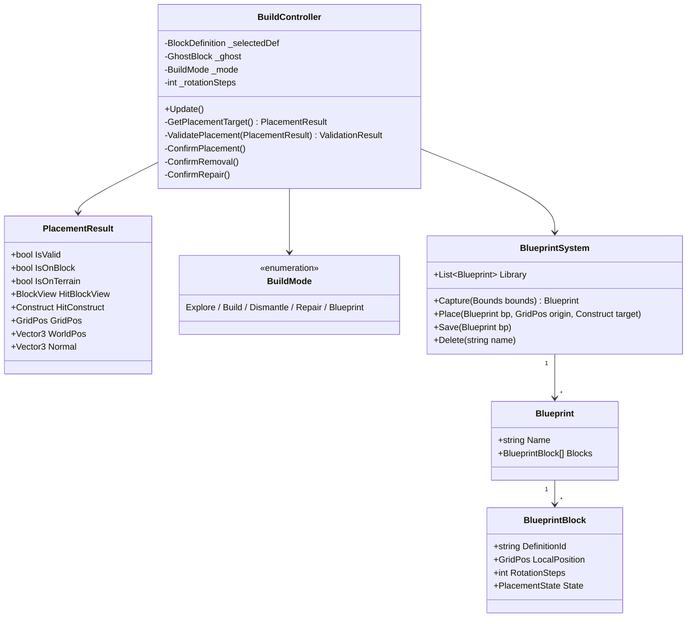
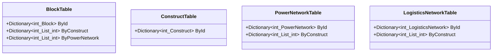
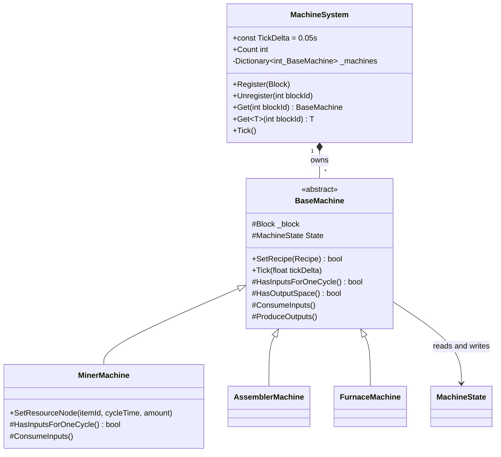
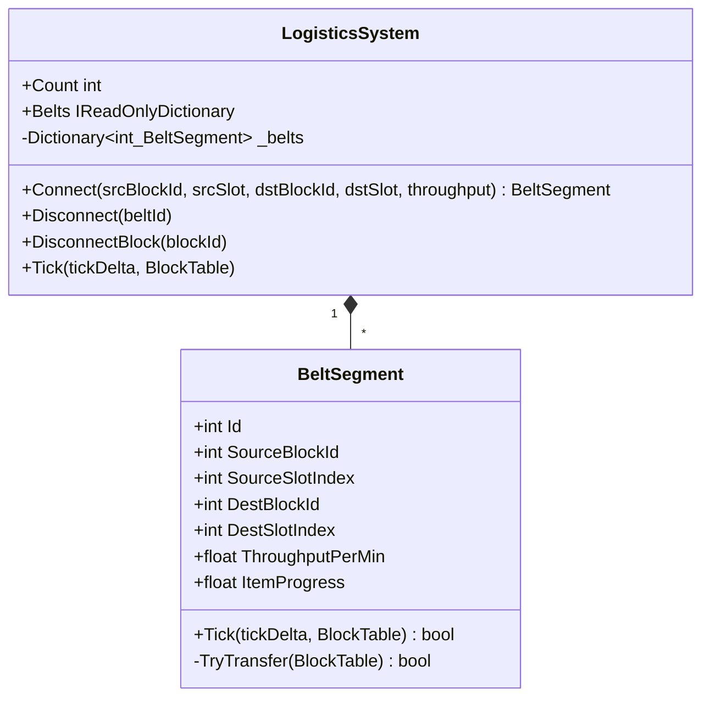

# Building System — UML Class Diagrams

Generated from Space_Crusade design documents (Vol1–5, Requirements v4, SDD).

---

## Architecture Overview

The building system is split into two layers:

**Simulation layer (pure C#, no Unity dependency)**
`Block`, `Construct`, `BlockDefinition`, `PowerNetwork`, tables, state, params.
Contains all game logic. Runs at a fixed 20 Hz tick rate via the accumulator pattern.

**View layer (Unity MonoBehaviours)**
`ConstructView`, `BlockView`, `BuildController`, `GhostBlock`, `GameManager`.
Reads simulation state and drives Unity transforms, renderers, colliders, and Rigidbodies.
Never writes to simulation state directly — calls simulation methods instead.

### Unity Scene Structure

Each construct is **one parent GameObject** (`ConstructView`) with a `Rigidbody`.
Each block is a **child GameObject** (`BlockView`) under its construct's parent.

```
Scene
└── Construct_42  (ConstructView + Rigidbody)
    ├── Block_1   (BlockView + MeshRenderer + BoxCollider)
    ├── Block_2   (BlockView + MeshRenderer + BoxCollider)
    └── Block_3   (BlockView + MeshRenderer + BoxCollider)
```

Unity automatically compounds all child `BoxCollider`s onto the parent `Rigidbody`,
giving each construct a single physics body with no manual compound collider setup.

**Block local position** = `block.GridPos * CellSize` (set once on spawn, or when the
block's GridPos changes). The Transform is the authoritative world position — the
simulation layer holds no world-space coordinates.

**Rigidbody mode:**
- `IsAnchored == true`  → `Rigidbody.isKinematic = true` (fixed base, no physics movement)
- `IsAnchored == false` → `Rigidbody.isKinematic = false` (vehicle, debris — full physics)

**Construct split:** instantiate a new parent GameObject, call
`blockView.transform.SetParent(newParent, worldPositionStays: true)` for each
block in the split component. Unity preserves world positions automatically.

---

## Cell Size

**1 cell = 0.5 m in world units.**
This constant is named `CellSize` and must be defined in exactly one place,
shared between the simulation and view layers. A 1×1×1 block is 0.5×0.5×0.5 m.
A 2×2×2 block is 1×1×1 m.

---

## 1 — Core Data Model (Simulation Layer)



---

## 2 — View Layer (Unity MonoBehaviours)



**Key rules:**
- `ConstructView` is the parent GameObject. Its `transform.position` is the construct's world origin.
- `BlockView` is a child of `ConstructView`. Its `transform.localPosition = block.GridPos * CellSize`.
- `Rigidbody` lives only on `ConstructView`. Child `BoxCollider`s are compounded onto it automatically.
- When GameManager receives a `ConstructSplitEvent`, it instantiates a new `ConstructView` and calls `SetParent(newParent, worldPositionStays: true)` on each affected `BlockView`.

---

## 3 — Simulation Architecture

### What gets ticked vs. what is event-driven

**Blocks are spatial data, not simulation actors.**
A wall, a foundation, a plank — nothing about a structural block changes between ticks.
Blocks are placed and removed as events; only systems with time-evolving state are ticked.

**Construct connectivity is event-driven, not ticked.**
The flood-fill connectivity check runs *once* when a block is placed or removed,
updates construct membership, then stops. There is no reason to recheck every tick.

**Only three systems are ticked at 20 Hz:**

| System | Why it ticks |
|--------|-------------|
| `PowerSystem` | Battery charge changes every tick; supply/demand balance must be recalculated |
| `LogisticsSystem` | Items physically advance along belts every tick |
| `MachineSystem` | Production cycle progress advances every tick |

**Functional blocks register with systems at placement and unregister at removal.**
A generator block placed on a construct calls `PowerSystem.Register(block)` — it does not
get processed by the simulation loop itself. The simulation loop only processes networks
and machine states, not individual blocks.



---

## 4 — Power System

Power balance per tick:
- `surplus = totalSupply - totalDemand`
- Surplus → charge batteries up to `MaxChargeRateKW`
- Deficit → batteries discharge first; if still short → throttle non-turret consumers proportionally
- Turrets always receive full power before other consumers are throttled



---

## 5 — Block Functional Parameters



---

## 6 — Build Mode & Placement



---

## Data Tables (Simulation Stores)



---

## 7 — Machine System



**Key rules:**
- `MachineSystem.Register(block)` is called by `Simulation.PlaceBlock()` — never manually.
- Only `Miner`, `Assembler`, and `Furnace` functional types receive a machine instance. Structural/power/logistics blocks are ignored.
- All machine state (`Mode`, `CycleProgress`, `InputBuffer`, `OutputBuffer`) lives on `Block.MachineState` so the view layer can read it without touching the machine object.
- `CycleProgress` is normalised [0, 1]. Overshoot is carried over (`-= 1f`) so fast machines don't lose fractional time.
- `SetRecipe()` in base validates `recipe.MachineType == block.Definition.FunctionalType`. Returns `false` on mismatch — wrong machine type silently rejects incompatible recipes.
- `MinerMachine.SetResourceNode()` builds a synthetic recipe with empty `Inputs` list, reusing the base Tick loop without modification.

---

## 8 — Logistics System



**Key rules:**
- `Machines.Tick()` runs before `Logistics.Tick()` each step — machines produce outputs first, belts move them second.
- Throughput uses the same accumulator pattern as machine `CycleProgress`: `ItemProgress += throughput/60 * tickDelta`. One item transfers each time it crosses 1.0.
- If a transfer is blocked (source empty, dest full, item type mismatch), `ItemProgress` is capped at 1.0 and retried next tick. Throughput is not wasted on failed transfers.
- `LogisticsSystem.DisconnectBlock(id)` is called by `Simulation.RemoveBlock()` before the block is deleted, ensuring no dangling belt references.
- Belt segments are direct connections for V1 (no belt blocks in the world yet). When belt blocks are added, each placed belt creates a `BeltSegment` here.

---

## Confirmed Design Decisions

| Decision | Detail |
|----------|--------|
| **Cell size** | **0.5 m per cell.** One constant named `CellSize`, shared everywhere. |
| **Construct = parent GameObject** | `ConstructView` MonoBehaviour + `Rigidbody`. All blocks are child GameObjects. |
| **Block positions** | Stored as integer `GridPos` in simulation. `localPosition = GridPos * CellSize` on the view. |
| **Rigidbody** | One per construct, on the parent. Kinematic for anchored bases, non-kinematic for vehicles. |
| **Construct split** | Spawn new parent GameObject, `SetParent(newParent, worldPositionStays: true)` on affected blocks. |
| **Colliders** | `BoxCollider` on each `BlockView` child. Compounded automatically onto parent `Rigidbody`. |
| **Grid model** | Bases/Outposts use integer grid (Foundation sets origin). Vehicles are freeform (any rotation). |
| **Structural integrity** | Connectivity-only for V1 — no stress or load simulation. |
| **Power wiring** | Auto-connects within pole range — no manual wire drawing. |
| **Construct classification** | Recalculated on block place/remove events, not every tick. |
| **Adjacency** | Face-adjacency only (6 directions). O(1) via `occupancy[gridPos + neighbour]` dictionary lookup. |
| **What the simulation ticks** | Only PowerSystem, LogisticsSystem, MachineSystem. Blocks and constructs are spatial data — updated on place/remove events, never ticked. |
| **System registration** | Functional blocks (generators, machines, belts) register with their system on placement and unregister on removal. The tick loop processes networks and states, not individual blocks. |
| **Dismantle recovery** | 100% material return in V1. |
| **Resource node depletion** | Infinite in V1. |
| **Camera** | First-person (not top-down as written in design docs). Player moves and looks with standard FPS controls. |
| **Terrain placement** | Blocks can be placed freely on terrain (no global grid constraint). Snapping only occurs when placing against an existing block face. |
| **Block-to-block snapping** | Face-plane snap: new block aligns to the face plane of the hit block, with valid centers determined by `hitFaceLeft + Round((cursor - hitFaceLeft - newHalf) / CellSize) * CellSize + newHalf`. Not a global-grid snap. |
| **Simulation layer** | Pure C# — zero Unity dependencies. No `UnityEngine` imports, no MonoBehaviours, no Vector3. All Unity coupling lives in the view layer only. |
| **Rotation — grid constructs** | 90° increments around Y-axis only (RotationSteps 0–3). |
| **Rotation — vehicles/freeform** | Continuous any-angle rotation (not yet implemented). |
| **Machine base class** | Abstract `BaseMachine` (pure C#). Template method pattern: `Tick()` in base, virtual `HasInputsForOneCycle`, `ConsumeInputs`, `ProduceOutputs` overridden per machine type. |
| **Machine state ownership** | All state (`Mode`, `CycleProgress`, `InputBuffer`, `OutputBuffer`) lives on `Block.MachineState`, not on the machine object. Machine objects are stateless logic carriers. |
| **Miner synthetic recipe** | `MinerMachine.SetResourceNode()` constructs a `Recipe` with empty `Inputs` so the base `Tick()` loop runs unmodified. `HasInputsForOneCycle()` is overridden to always return true. |
| **CycleProgress normalisation** | `[0, 1]` float. Resets via `-= 1f` (not `= 0f`) to carry over overshoot at high speed. |
| **Machine registration** | `Simulation.PlaceBlock()` calls `MachineSystem.Register(block)`. `Simulation.RemoveBlock()` calls `MachineSystem.Unregister(blockId)`. No self-registration in constructors. |
| **FunctionalType: Furnace** | Added to enum. Smelting recipes use `FunctionalType.Furnace`; they are rejected by Assembler and vice versa. |
| **Recipe — pure C# not ScriptableObject** | `Recipe` lives in the simulation layer (pure C#). ScriptableObject would import Unity and break sim isolation. Future designer editing uses a `RecipeAsset` ScriptableObject in the view layer that converts to `Recipe` at startup. |
| **RecipeCatalogue** | Static class of shared immutable `Recipe` instances, same pattern as `BlockCatalogue`. Never mutated at runtime. |
| **Miner recipes** | Not stored in `RecipeCatalogue`. `MinerMachine.SetResourceNode()` constructs a synthetic `Recipe` at runtime from the node's item/rate/amount. |
| **Belt throughput** | Mk1 conveyor: 60 items/min. Uses progress accumulator (`ItemProgress += throughput/60 * tickDelta`) — same pattern as machine `CycleProgress`. No item-in-transit objects. |
| **Belt stall behaviour** | If a transfer is blocked, `ItemProgress` is capped at 1.0 (not allowed to accumulate further). Retried next tick without wasting throughput. |
| **Tick order** | `MachineSystem.Tick()` → `LogisticsSystem.Tick()`. Machines produce first, belts distribute second within the same simulation step. |
| **Belt V1 scope** | Belt segments are logical connections (no belt blocks in the world). `LogisticsSystem.Connect()` wires two machine slots directly. Belt block placement comes later. |
| **Port definitions** | Each `BlockDefinition` carries a `PortDefinition[]`. Each port has `Index` (maps 1:1 to buffer slot), `Type` (Input/Output), and `Face` (which block face the spline attaches to in the view layer). |
| **Belt length source** | `LengthInCells = floor(splineArcLength / CellSize)`. NOT the straight-line grid distance between machines. The view layer computes arc length from the spline fitted through port anchors and belt-stand waypoints, then passes it to `LogisticsSystem.Connect()`. |
| **Belt stands** | Future waypoint blocks. Placed freely (not grid-constrained); act as intermediate spline anchors for routing belts around obstacles. Each stand has one input port and one output port. |
| **Belt grid rule** | Belts are NOT grid-constrained. They follow splines between port anchor points. Only machines and blocks snap to the integer grid. |
