# Vision and Design Pillars

**Reclamation** is a first-person factory-and-survival game in which the player
mines resources, automates production, defends an evolving base, and ultimately
builds and pilots vehicles. It blends the automation depth of *Factorio* /
*Satisfactory* with the block-construction and physics of *Space Engineers*.

## Pillars

1. **Automate everything.** Raw resources flow through miners, furnaces, and
   assemblers along belts into ever-larger production chains.
2. **Build physically real structures.** Everything is built from blocks on a
   grid. Structures grounded on terrain are static; anything cut loose obeys
   physics (the *Space Engineers* model).
3. **Defend the factory.** Power-hungry auto-turrets consume ammunition produced
   by the same factory they protect.
4. **Go mobile.** The same block system that builds bases will build vehicles
   that the player can pilot (planned).

## Design constraints (non-negotiable)

- **Strict simulation / view separation.** All game logic lives in a pure-C#
  simulation layer with zero `UnityEngine` dependencies. Unity is a rendering
  and input shell that reads simulation state and calls simulation methods.
- **Deterministic fixed tick.** The simulation advances at a fixed 20 Hz,
  decoupled from frame rate.
- **Data-driven content.** Blocks, items, and recipes are immutable definitions
  in static catalogues, shared across all instances.

---

# Reading Guide and Legend

This document is the single source of truth ("the bible") for Reclamation's core
systems. It consolidates the prior per-system notes in `docs/` and reflects the
**current code** as well as **planned** work.

Throughout, status is marked as:

- **(current)** — implemented and in the codebase today.
- **(planned)** — designed and specified here, not yet implemented.
- **(V1 simplification)** — deliberately stubbed for the first milestone.

UML and flow diagrams are rendered from editable Mermaid sources in
`docs/diagrams/`. See the Appendix for how to regenerate this PDF.

---

# Architecture

## Two layers

The codebase is split into a **simulation layer** (`Assets/Simulation/`, pure C#)
and a **view layer** (`Assets/View/`, Unity `MonoBehaviour`s). The view layer
calls into the simulation to mutate state (place a block, set a recipe) and reads
simulation state every frame to drive transforms, renderers, and colliders. The
simulation never references Unity and never reads back from the view.

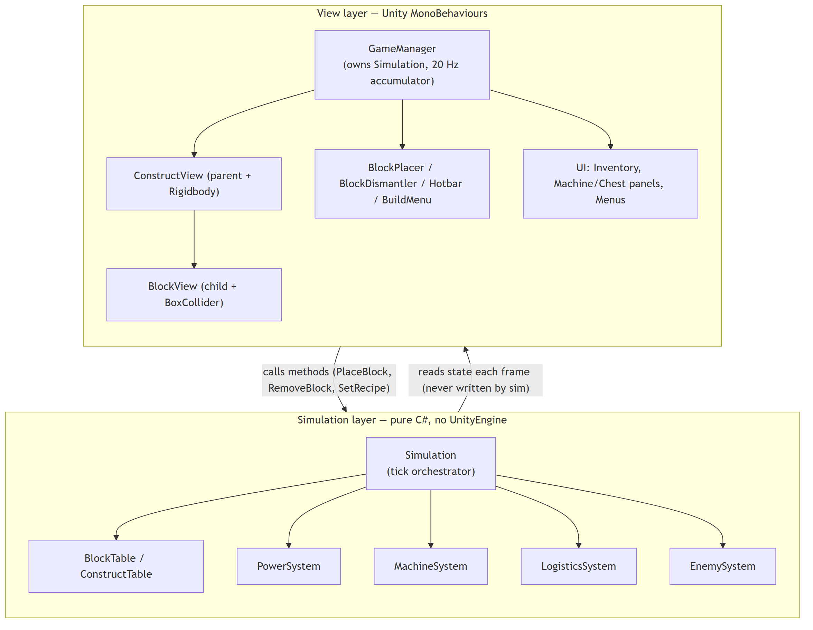

## The fixed tick loop

`GameManager` (the only place the two layers meet at the top level) owns the
`Simulation` instance and drives it with an accumulator so the simulation steps a
fixed 20 Hz regardless of rendering frame rate.

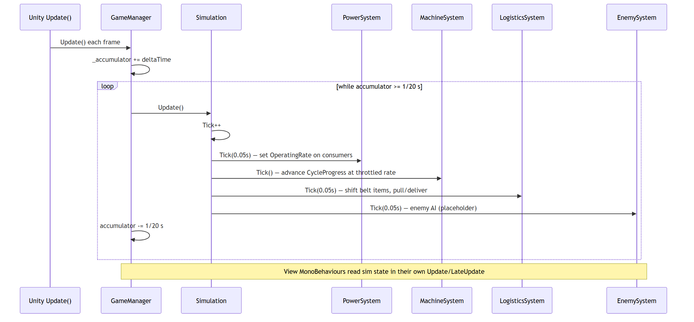

Each tick runs three time-evolving systems in a fixed order, then the enemy
placeholder:

1. **Power** — recomputes supply/demand and writes `OperatingRate` onto every
   consumer.
2. **Machines** — advance production cycles at the (now known) throttled rate.
3. **Logistics** — move items along belts between machine buffers.
4. **Enemies** — placeholder AI tick.

Power runs first so that machines and belts see the correct throttle within the
same tick.

## Cell size and coordinates

- **1 cell = 0.5 m** in world units (the shared constant `CellSize`). A 1x1x1
  block is 0.5 m on a side; a 2x2x2 block is 1 m.
- Block positions are stored as integer `GridPos` **local to their construct** —
  the simulation holds no world-space floats. The construct's Unity `Transform`
  is the authoritative world position; a block's `localPosition` is
  `GridPos * CellSize` plus a half-size centering offset.

---

# Core Data Model

Three types form the spine of the simulation: an immutable **`BlockDefinition`**
(the "type"), a placed **`Block`** instance, and the **`Construct`** that groups
connected blocks into one physics and logistics unit.

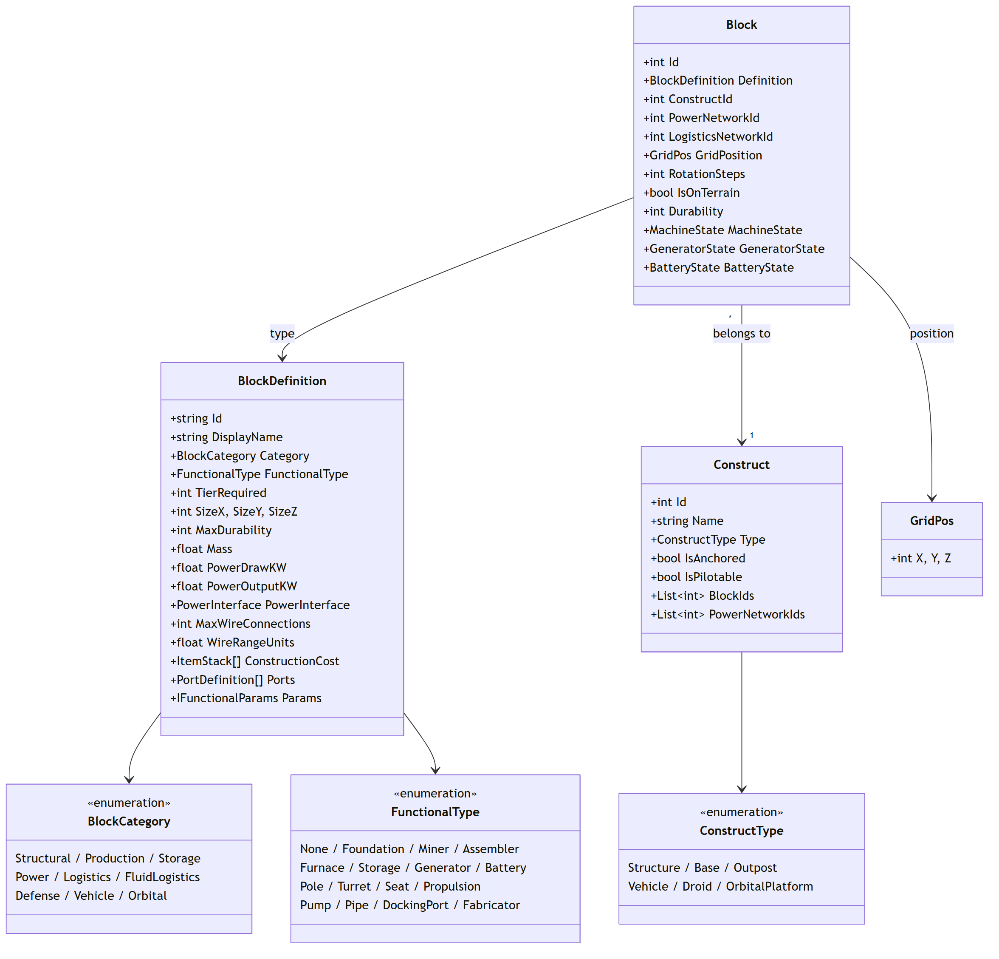

## Key types

- **`BlockDefinition`** — shared, immutable description of a block type: size,
  mass, durability, power draw/output, power interface, construction cost, I/O
  ports, and an optional `IFunctionalParams` payload specific to its function.
- **`Block`** — one placed instance: its definition, owning construct, grid
  position, rotation, durability, the `IsOnTerrain` flag (drives physics), and up
  to three optional runtime-state objects (`MachineState`, `GeneratorState`,
  `BatteryState`).
- **`Construct`** — a group of face-connected blocks acting as one unit. Holds
  `BlockIds`, classification (`Type`), and the physics flags `IsAnchored` /
  `IsPilotable`.

## Enumerations

- **`BlockCategory`** — broad role: Structural, Production, Storage, Power,
  Logistics, FluidLogistics, Defense, Vehicle, Orbital.
- **`FunctionalType`** — specific behaviour, drives which system and which params
  class apply: None, Foundation, Miner, Assembler, Furnace, Storage, Generator,
  Battery, Pole, Turret, Seat, Propulsion, Pump, Pipe, DockingPort, Fabricator.
- **`ConstructType`** — derived classification: Structure, Base, Outpost,
  Vehicle, Droid, OrbitalPlatform.

---

# Constructs and Connectivity

A construct is created when an isolated block is placed and destroyed when its
last block is removed. Connectivity is **event-driven, not ticked**: the
flood-fill runs once on placement/removal, not every frame.

- **Placement on terrain** creates a fresh construct whose first block has
  `IsOnTerrain = true`.
- **Placement on an existing block** joins that block's construct.
- **Removal** (`Simulation.RemoveBlock`) deletes the block, then flood-fills the
  remaining blocks by **face adjacency**. If removal severed the construct, each
  disconnected component beyond the first becomes a new construct (with new IDs),
  and the method returns those new IDs so the view can build matching
  `ConstructView` objects.
- **Adjacency** is face-only (6 directions): two blocks touch when they meet on
  one axis and overlap on the other two.

Unity scene structure mirrors this: each construct is one parent GameObject
(`ConstructView`); each block is a child GameObject (`BlockView`). Unity compounds
all child `BoxCollider`s onto the parent automatically, so a construct is a single
physics body with no manual compound-collider setup.

> **Merging across constructs** (docking two separate constructs) is deferred to
> a future docking system. `MergeInto` exists but is only safe within a shared
> coordinate space; cross-construct grid positions are not comparable.

---

# Simulation Systems Overview

`Simulation` owns the data tables and the four systems. Only three systems carry
time-evolving state and are ticked; connectivity and classification are
event-driven.

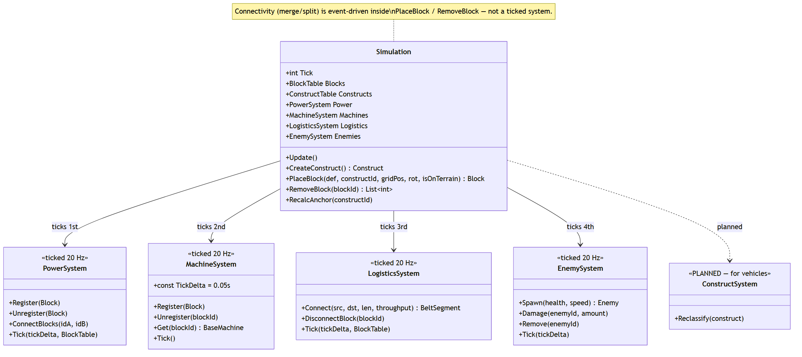

| System | Ticked? | Responsibility |
|---|---|---|
| `PowerSystem` | 20 Hz | Balance supply/demand per network; set consumer `OperatingRate`; charge/discharge batteries. |
| `MachineSystem` | 20 Hz | Advance each machine's production cycle at its throttled rate. |
| `LogisticsSystem` | 20 Hz | Shift items along belts; pull from / deliver to machine buffers. |
| `EnemySystem` | 20 Hz | Track live enemies; apply damage; placeholder AI. |
| Connectivity (in `Simulation`) | event | Merge/split constructs on place/remove. |
| `ConstructSystem` **(planned)** | event | Reclassify constructs (`Type`, `IsPilotable`) for vehicles. |

Functional blocks **register** with their system at placement and **unregister**
at removal. The tick loop processes networks and machine states, never iterating
raw blocks.

---

# Building and Placement

Placement is a view-layer concern that ends in a single simulation call,
`Simulation.PlaceBlock(...)`. Removal calls `Simulation.RemoveBlock(...)`.

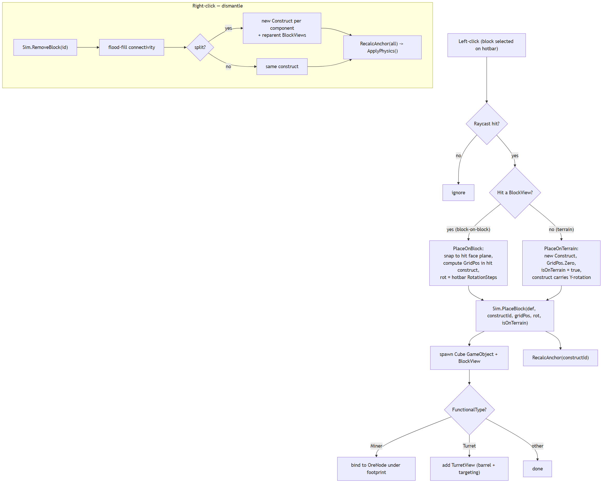

## Placement rules (current)

- **Terrain placement** is free-form: the block snaps to the cursor hit point (no
  global grid), the construct's transform carries the Y-rotation, and the first
  block is flagged `IsOnTerrain = true`.
- **Block-on-block placement** snaps the new block to the *face plane* of the hit
  block: the constrained axis butts against the face, and the two free axes snap
  to the nearest grid cell. Rotation is in 90-degree steps about Y
  (`RotationSteps` 0-3), which swaps X/Z footprint on odd steps.
- **Miners** auto-bind to an ore node under their footprint on placement.
- **Turrets** get a `TurretView` (barrel + targeting) attached after placement.

## View components

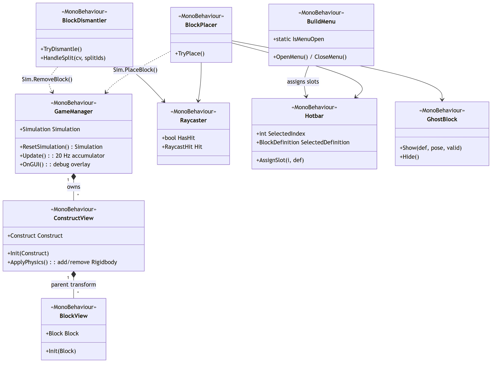

- **`Hotbar`** — 10 slots (8 reassignable block slots + Wire and Belt tools).
  Number keys select; scroll rotates the held block. `BuildMenu` (Q) assigns any
  catalogue block to a hotbar slot.
- **`Raycaster`** — shared crosshair raycast used by placer, dismantler, and info
  HUD.
- **`BlockPlacer` / `BlockDismantler`** — left-click places, right-click
  dismantles, including re-parenting split pieces and re-evaluating physics.
- **`GhostBlock`** — translucent placement preview.

> **Dismantle recovery** returns 100% of materials in V1.

---

# Power System

Power is simulated per **network**. A network owns lists of generator, battery,
consumer, and pole block IDs and tracks supply, demand, and a `PowerState`.

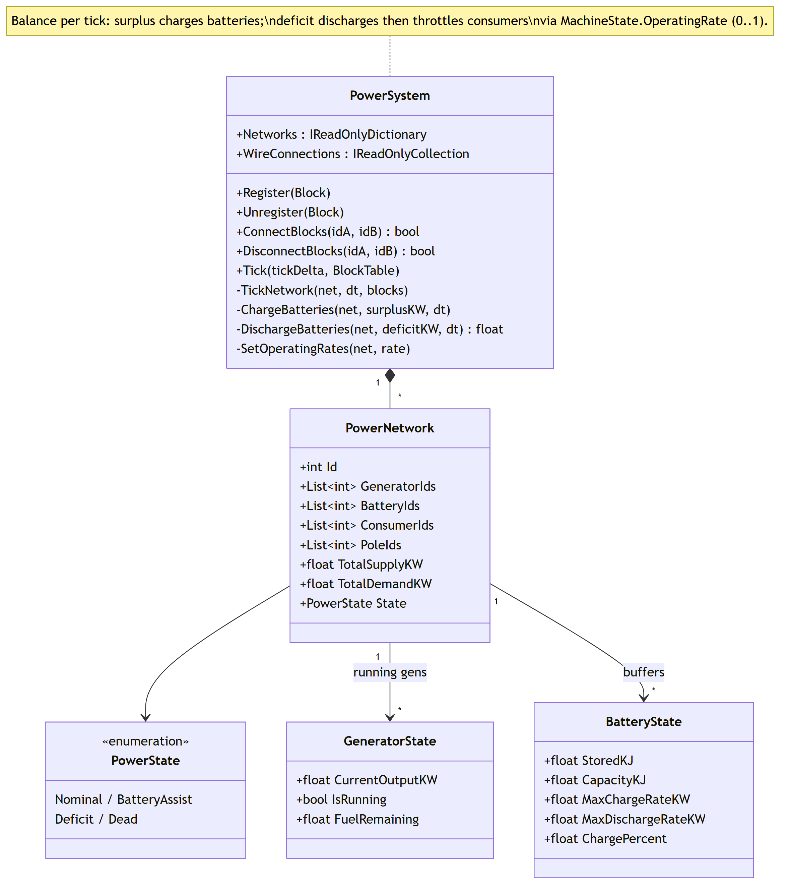

## Balance algorithm (per tick)

1. `supply = sum of running generators' CurrentOutputKW`.
2. `demand = sum of consumer draw`, scaled by each machine's mode
   (Operating = 100%, Waiting = 25%, Idle/NoPower = 0%).
3. **Surplus** -> charge batteries up to each battery's `MaxChargeRateKW`; state
   `Nominal`.
4. **Deficit** -> discharge batteries up to `MaxDischargeRateKW`. If that covers
   demand the state is `BatteryAssist`; if partial, `Deficit`; if effective
   supply is zero, `Dead`.
5. In deficit, `OperatingRate = effectiveSupply / demand` is written to every
   consumer's `MachineState`, throttling them proportionally.

## Wiring

Power wiring is explicit and *Satisfactory*-style: select the Wire tool, click
pole A then pole B. `PowerSystem` stores a `HashSet` of wire connections that the
`PowerWireView` draws. Out-of-range or over-connection-limit links are rejected.

| Decision | Value |
|---|---|
| Generators (V1) | Run unconditionally; fuel consumption is a future `FuelSystem`. |
| Networks per construct | Lazily created on first block register; multiple supported in the table. |
| Turret priority | Planned: turrets receive full power before other consumers throttle. |

---

# Production: Machines and Recipes

All active production blocks derive from the abstract **`BaseMachine`** using a
template-method pattern: the base `Tick()` drives the cycle, while subclasses
override input/output checks and consumption.

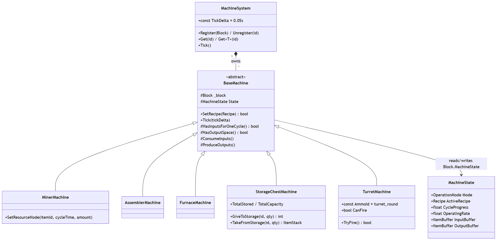

## Machine types (current)

- **`MinerMachine`** — extracts from an ore node; uses a synthetic recipe with no
  inputs so the base tick loop runs unmodified.
- **`FurnaceMachine`** — 1-in / 1-out smelting.
- **`AssemblerMachine`** — multi-input crafting from a selected recipe.
- **`StorageChestMachine`** — passive storage; `GiveToStorage` / `TakeFromStorage`.
- **`TurretMachine`** — consumes ammo, fires on cooldown (see Combat).

## Machine state machine

`MachineState.Mode` transitions drive both production and power draw.

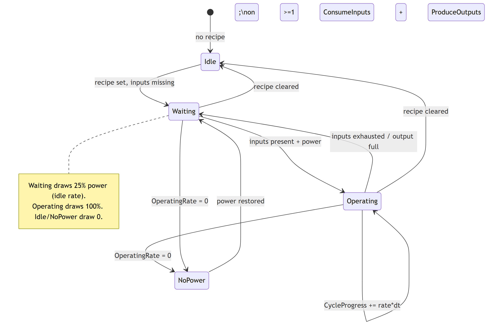

## Key rules

- All runtime state (`Mode`, `CycleProgress`, buffers, `OperatingRate`) lives on
  `Block.MachineState`, so the view reads it without touching the machine object.
  Machine objects are stateless logic carriers.
- `CycleProgress` is normalised to [0, 1] and resets via `-= 1` to carry over
  overshoot at high speeds.
- `SetRecipe` rejects recipes whose `MachineType` does not match the block's
  `FunctionalType` (a furnace will not run an assembler recipe).

## Recipes

`Recipe` is pure C# (not a `ScriptableObject`, which would import Unity).
`RecipeCatalogue` holds shared, immutable recipes. Miner "recipes" are synthesised
at runtime from the ore node, not stored in the catalogue.

---

# Logistics: Belts

Belts move items between machine ports. A `BeltSegment` is modelled as a **shift
register** of one slot per 0.5 m cell.

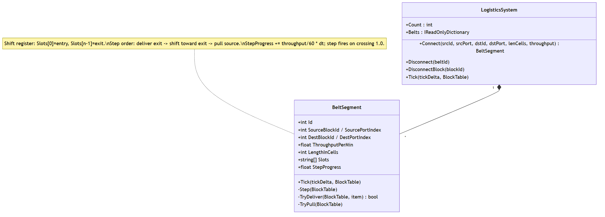

- `Slots[0]` is the entry (source side); `Slots[n-1]` is the exit (dest side).
- **Step order** each belt step: (1) deliver the exit slot into the destination's
  input buffer; (2) shift items toward the exit, exit-side first so nothing moves
  twice; (3) pull one item from the source's output buffer into the entry slot.
- Blocked items stall in place and naturally back up the belt behind them.
- **Timing:** `StepProgress += throughput/60 * tickDelta`; a step fires each time
  it crosses 1.0. At 60 items/min and 20 Hz, that is one step per second.
- `LengthInCells = floor(splineArcLength / CellSize)` — the view computes belt
  length from the routed spline, not straight-line distance.

> **V1 scope:** belt segments are logical connections wired directly between two
> machine slots; in-world belt blocks and belt stands come later.

---

# Block Functional Parameters

Each `BlockDefinition` may carry one `IFunctionalParams` payload that configures
its function. This keeps `BlockDefinition` generic while giving each functional
type its own tunables.

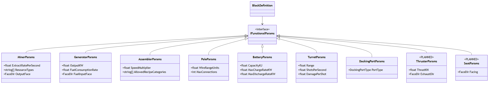

`ThrusterParams` and `SeatParams` are **planned** for the vehicle milestone (see
Vehicles).

---

# Items, Inventory, and UI

Items follow the same split: pure-C# definitions and buffers in the simulation,
Unity widgets and panels in the view.

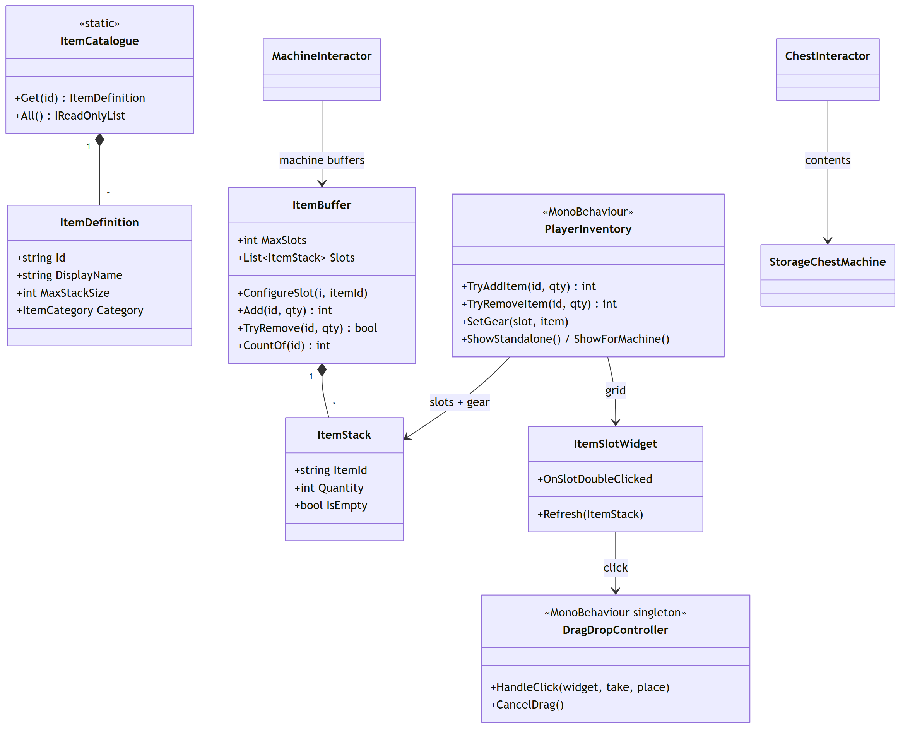

## Model

- **`ItemDefinition`** (in `ItemCatalogue`) — id, display name, max stack size,
  category. **`ItemStack`** — an (id, quantity) pair. **`ItemBuffer`** — a
  fixed-slot container used by machine input/output and storage.
- **`PlayerInventory`** — general slots (configurable 8-80, default 32) plus seven
  gear slots (Head, Chest, Legs, Feet, Primary, Secondary, Utility).

## Interaction

A click-to-hold **`DragDropController`** singleton mediates all slot moves.

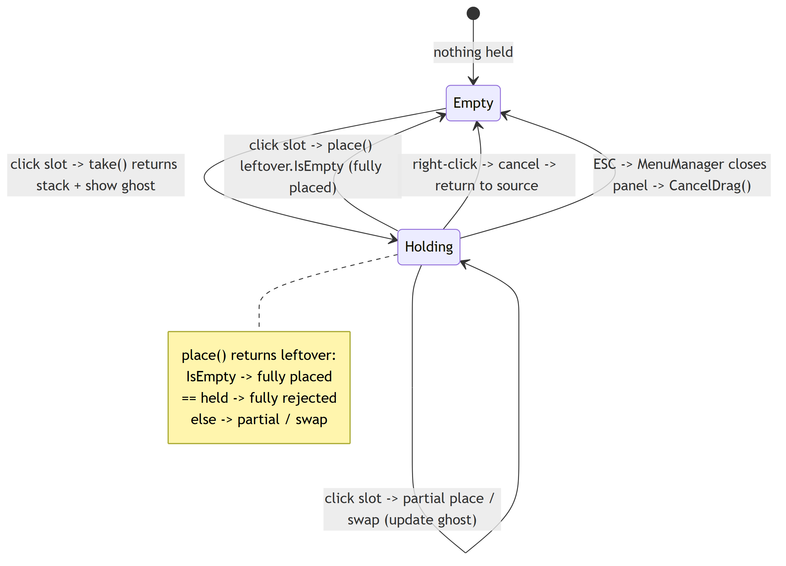

When a machine or chest is opened (E), its panel anchors left and the inventory
opens to the right ("dual-panel", *Satisfactory*-style). Standalone inventory (I)
centres. The left-panel interactor owns the cursor in dual mode.

## Panels (current)

- **`MachineInteractor`** — input buffer slots, recipe/resource buttons, output
  slots, clear button; rebuilds on recipe change.
- **`ChestInteractor`** — capacity bar plus a 5x6 grid sorted by quantity, with an
  overflow indicator.

---

# Combat

A factory-integrated defence loop: the factory crafts ammunition that powers
auto-turrets against advancing enemies.

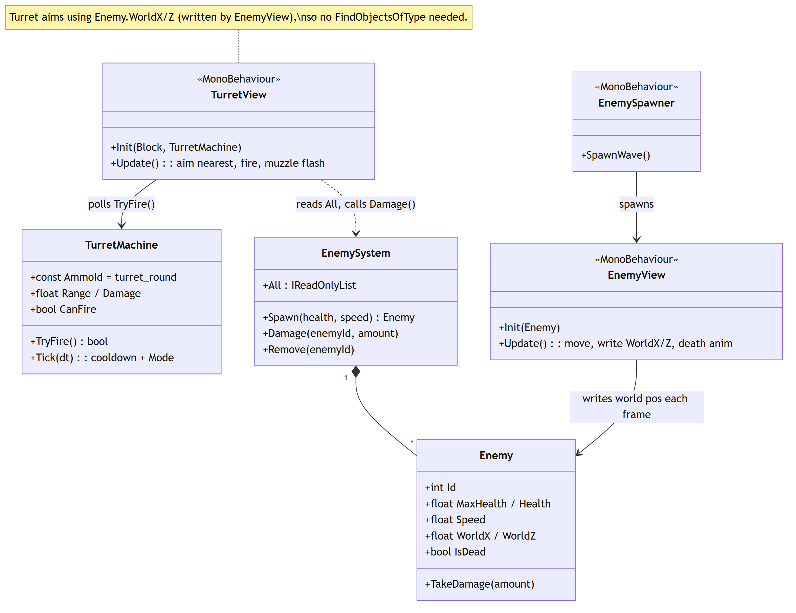

## Auto-turret

- **`TurretMachine`** (sim) — a 1-slot ammo buffer pre-configured for
  `turret_round`, no recipe, no output. `Tick` decrements a fire cooldown and sets
  `Operating` (ammo present) or `Waiting` (empty). `TryFire()` consumes one round
  and resets the cooldown.
- **`TurretView`** (view) — built on the block after placement. It aims the barrel
  at the nearest in-range enemy (120 deg/s), polls `TryFire()` each frame, applies
  damage via `EnemySystem.Damage`, and flashes a muzzle light.
- Power-gated like any consumer: a deficit lowers `OperatingRate` and thus fire
  rate; no ammo shows Waiting (yellow); no power shows NoPower (red).

## Enemies (placeholder)

- **`Enemy`** carries health, speed, and `WorldX/WorldZ`. The world position is
  **written by `EnemyView` each frame**, so turrets can range-check against
  `EnemySystem.All` without a `FindObjectsOfType` call while movement stays at
  frame rate.
- **`EnemySpawner`** spawns waves on a ring around the player up to a live cap.

## Ammo

| Item | Stack | Recipe (Assembler) |
|---|---|---|
| `turret_round` | 200 | `craft_turret_rounds`: 2 `iron_plate` -> 20, 1.0 s |
| `rifle_round` | 200 | `craft_rifle_rounds`: 1 `iron_plate` -> 10, 1.0 s |

---

# Physics: Grounded Constructs

Reclamation uses the *Space Engineers* model: a structure **grounded** on terrain
is static; if it is cut free of all terrain contact it becomes a dynamic physics
body that falls and can be pushed or driven.

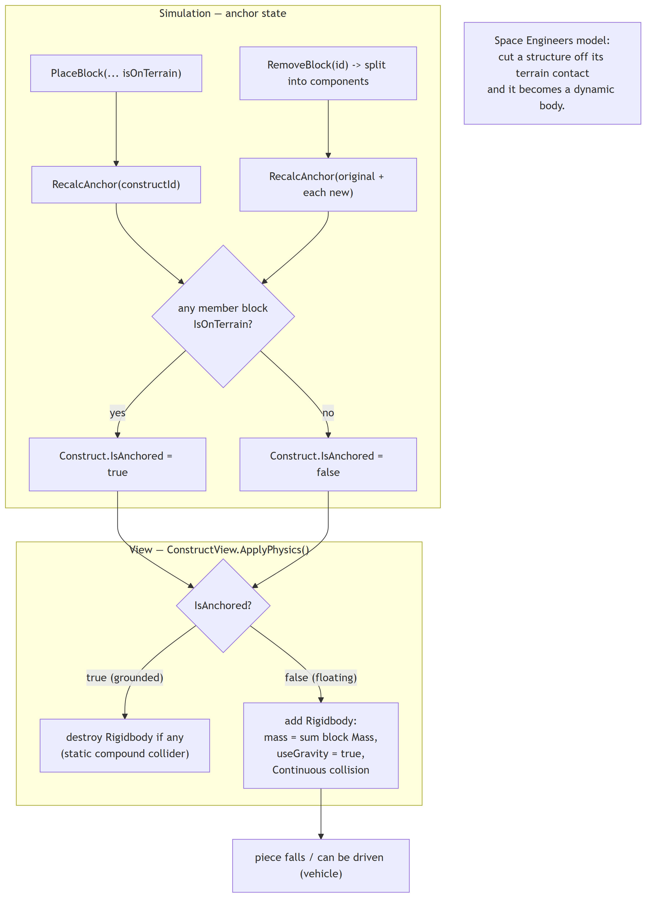

## Model

- **`Block.IsOnTerrain`** is set true only for the first block of a terrain
  placement, and is persisted in saves.
- **`Construct.IsAnchored`** is recomputed by `Simulation.RecalcAnchor()` after
  any placement, removal, or split: it is true if **any** member block is on
  terrain.
- **`ConstructView.ApplyPhysics()`** reads that flag:
  - **Anchored** -> destroy any `Rigidbody` (a static compound collider, free).
  - **Floating** -> add a `Rigidbody`: mass = sum of member `BlockDefinition.Mass`,
    gravity on, continuous collision detection.

## The canonical scenario

1. Build blocks up from the terrain — one construct, anchored, static.
2. Right-click the bottom terrain block. Flood-fill finds the now-disconnected
   upper piece, gives it a new construct, `RecalcAnchor` finds no terrain contact,
   and `ApplyPhysics()` adds a `Rigidbody`.
3. The severed piece falls under gravity.

> This physics foundation is exactly what vehicles build on: a vehicle is a
> non-anchored construct whose thrusters push its `Rigidbody`.

---

# Vehicles (Planned)

Full specification lives in `docs/VehicleSystem.md`; summarised here as part of
the core loop. A **vehicle is a non-anchored construct** with a seat, propulsion,
and power, that converts pilot input into thrust forces on its `Rigidbody`.

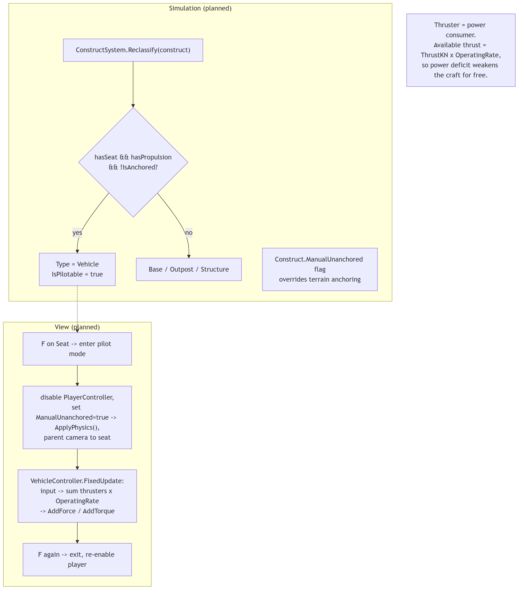

## Design highlights

- **Thrusters are power consumers.** Available thrust = `ThrustKN * OperatingRate`,
  so the existing power-throttling code makes a power deficit weaken the craft for
  free — no new power logic.
- **Releasing from terrain.** A new `Construct.ManualUnanchored` override lets a
  ground-built craft become free-floating without removing its blocks.
- **Classification.** A new `ConstructSystem.Reclassify()` sets `Type = Vehicle`
  and `IsPilotable = true` when a construct has a seat, propulsion, and is not
  anchored.
- **Pilot mode (view).** F on a seat disables the character controller, parents the
  camera to the seat, and enables a `VehicleController` that maps WASD / Space /
  Ctrl to summed thruster forces.

## Milestones

1. **Blocks + classification (sim):** `ThrusterParams`/`SeatParams`, Pilot Seat and
   Thruster blocks, `ConstructSystem.Reclassify()`, `ManualUnanchored`.
2. **Release + validate:** toggle anchor, watch the craft fall and rest.
3. **Pilot mode + control (view):** seat entry, camera, `VehicleController` forces.
4. **Polish:** gyroscope/flight assist, vehicle HUD, thruster VFX, docking ports.

## Risks

- Center of mass must be set from block mass or craft will tumble.
- Thrust vs. summed mass needs balancing.
- A piloting player must be parented to the moving construct so they do not slide
  off the compound collider.

---

# Save and Load

The whole scene serialises to a single JSON file
(`persistentDataPath/save.json`). Save is F5; load is F9, and the game also
auto-loads on startup.

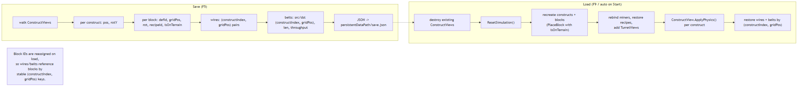

- **Saved:** constructs (world position + Y rotation); blocks (def id, grid pos,
  rotation, recipe id, `isOnTerrain`); explicit wire connections; active belt
  segments.
- **Not saved (V1):** machine buffer contents, battery charge, cycle progress —
  these reset on load (miners re-bind to ore nodes, machines restart empty).
- **Stable references:** block IDs are reassigned on load, so wires and belts
  reference blocks by `(constructIndex, gridPos)` keys that survive the churn.
- **Physics on load:** `ConstructView.ApplyPhysics()` runs once per construct after
  its blocks load, so floating constructs return as dynamic bodies.

---

# Content Catalogues

The current shipping content. All entries are immutable definitions in static
catalogues (`BlockCatalogue`, `ItemCatalogue`, `RecipeCatalogue`).

## Blocks

| Block | Category | FunctionalType | Size | Power | Notes |
|---|---|---|---|---|---|
| Small Cube | Structural | None | 1x1x1 | - | Prototype structural |
| Large Cube | Structural | None | 2x2x2 | - | Prototype structural |
| Plank | Structural | None | 4x1x1 | - | Prototype structural |
| Steam Generator | Power | Generator | 2x2x2 | +120 kW | Node interface |
| Small Battery | Power | Battery | 1x2x1 | buffer | 500 kJ |
| Power Pole | Power | Pole | 1x1x1 | - | 4 wire connections |
| Basic Miner | Production | Miner | 2x2x2 | -30 kW | Binds to ore node |
| Electric Furnace | Production | Furnace | 2x2x2 | -60 kW | 1-in / 1-out |
| Assembler Mk1 | Production | Assembler | 3x2x3 | -75 kW | 3 input ports |
| Storage Chest | Storage | Storage | 1x1x1 | - | Passive |
| Gun Turret | Defense | Turret | 1x2x1 | -20 kW | Ammo-fed auto-turret |

## Recipes (selected)

| Recipe | Machine | Inputs -> Outputs |
|---|---|---|
| Iron Gear Wheel | Assembler | iron_plate -> iron_gear |
| Copper Wire | Assembler | copper_plate -> copper_wire |
| Circuit Board | Assembler | copper_wire + iron_plate -> circuit_board |
| Craft Turret Rounds | Assembler | 2 iron_plate -> 20 turret_round |
| Craft Rifle Rounds | Assembler | 1 iron_plate -> 10 rifle_round |

---

# UI Surfaces

Nine UI surfaces exist today, built procedurally in each component's `Start()`.
They are candidates for hand-designed Unity prefabs later.

| # | Surface | Trigger | Notes |
|---|---|---|---|
| 1 | Crosshair | always | Center reticle |
| 2 | Hotbar | always | 10 slots, number-key select |
| 3 | Block Info HUD | aim at block | Name, grid, mode, power |
| 4 | Build Menu | Q | Category tabs + block grid; assigns hotbar |
| 5 | Player Inventory | I / dual | 8-col grid + 7 gear slots |
| 6 | Machine Panel | E on machine | Buffers + recipe buttons |
| 7 | Chest Panel | E on chest | Capacity bar + 5x6 grid |
| 8 | Pause Menu | ESC | Resume/Settings/Save/Load/Quit |
| 9 | Settings | from Pause | Sensitivity, volume, fullscreen, quality |

**Not built yet:** main menu, player health/ammo HUD, enemy health bars,
notification system.

---

# Roadmap and Gaps

## Implemented

Save/load, terrain and block-on-block placement, build menu + hotbar, power
networks (generators, batteries, poles, wires), miners/furnaces/assemblers,
belts, storage, item UI (inventory, machine, chest), auto-turret + enemy
placeholder, grounded-construct physics.

## Designed, not yet built

- **Vehicles** (this document + `VehicleSystem.md`): seat/thruster blocks,
  `ConstructSystem` reclassification, pilot mode, `VehicleController`.
- **Construct reclassification** (`Type`, `IsPilotable`) is referenced but not
  implemented.

## Known V1 simplifications to revisit

- Generators run without fuel (no `FuelSystem`).
- Resource nodes are infinite (no depletion).
- No tier/progression gating beyond `TierRequired` on definitions.
- Inserters and in-world belt blocks/stands not yet implemented.
- Cross-construct docking/merge deferred.
- Turret power priority not yet enforced.

---

# Confirmed Design Decisions

A consolidated record of decisions that constrain implementation. (Condensed from
the prior building-system notes.)

| Decision | Detail |
|---|---|
| Cell size | 0.5 m per cell; one shared `CellSize` constant. |
| Construct = parent GameObject | `ConstructView` parent; blocks are child GameObjects; colliders compound automatically. |
| Block positions | Integer `GridPos` in sim; `localPosition = GridPos * CellSize` in view. |
| Simulation isolation | Pure C#, zero `UnityEngine` references, no `Vector3` in sim. |
| What ticks | Only Power, Machines, Logistics (+ Enemies). Blocks/constructs are event-driven data. |
| System registration | Functional blocks register/unregister with their system on place/remove. |
| Connectivity | Flood-fill on place/remove only; face-adjacency (6 dirs). |
| Construct split | New parent GameObject; `SetParent(worldPositionStays:true)` per block. |
| Physics anchoring | Anchored (any block on terrain) -> no Rigidbody; floating -> Rigidbody + gravity. |
| Rotation (grid) | 90-degree steps about Y (`RotationSteps` 0-3). |
| Rotation (vehicles) | Continuous any-angle (planned). |
| Terrain placement | Free-form, no global grid; snapping only against block faces. |
| Block-to-block snap | Snap to hit face plane; free axes to nearest cell. |
| Machine base | Abstract `BaseMachine`, template-method `Tick`. |
| Machine state ownership | All state on `Block.MachineState`; machines are stateless logic. |
| CycleProgress | Normalised [0,1]; resets via `-= 1` to carry overshoot. |
| Miner recipe | Synthetic no-input recipe built at runtime from the node. |
| Recipe type | Pure C# `Recipe`; `RecipeCatalogue` static + immutable. |
| Waiting power draw | 25% of operating draw while stalled. |
| Consumer throttling | `OperatingRate = effectiveSupply / demand`, written to consumers. |
| Tick order | Power -> Machines -> Logistics, so throttle is current within a tick. |
| Power wiring | Explicit pole-to-pole wires; stored as a set, drawn by `PowerWireView`. |
| Belt model | Shift register; one slot per cell; `floor(arcLength / CellSize)` length. |
| Belt throughput | Mk1 = 60 items/min; step fires on `StepProgress` crossing 1.0. |
| Ports | `PortDefinition[]` per block; `Index` maps 1:1 to buffer slot. |
| Dismantle recovery | 100% material return (V1). |
| Resource depletion | Infinite (V1). |
| Camera | First-person FPS controls. |
| Save references | Wires/belts keyed by `(constructIndex, gridPos)`, ID-churn safe. |

---

# Appendix

## Regenerating this document

This PDF is generated from `docs/DesignBible.md` and the Mermaid sources in
`docs/diagrams/`. To rebuild after editing:

```
# 1. Re-render any changed diagrams (Mermaid -> PNG)
mmdc -i docs/diagrams/<name>.mmd -o docs/diagrams/<name>.png -b white -s 3

# 2. Rebuild the PDF (pandoc + LaTeX)
pandoc docs/DesignBible.md -o docs/DesignBible.pdf \
  --pdf-engine=pdflatex -H docs/bible_header.tex \
  --toc --toc-depth=2 -N \
  -V geometry:margin=1in -V fontsize=11pt \
  -V colorlinks=true -V linkcolor=blue -V toccolor=blue \
  -V documentclass=report
```

The full build is also scripted in `docs/build_bible.sh`.

## Source map

| Area | Key files |
|---|---|
| Tick / entry | `Assets/View/GameManager.cs`, `Assets/Simulation/Simulation.cs` |
| Core model | `Assets/Simulation/Block.cs`, `Construct.cs`, `BlockDefinition.cs` |
| Power | `Assets/Simulation/Systems/PowerSystem.cs`, `PowerNetwork.cs` |
| Machines | `Assets/Simulation/Systems/BaseMachine.cs`, `Machines/*.cs`, `MachineSystem.cs` |
| Logistics | `Assets/Simulation/Systems/LogisticsSystem.cs`, `BeltSegment.cs` |
| Items/UI | `Assets/Simulation/Items/ItemCatalogue.cs`, `Assets/View/PlayerInventory.cs`, `MachineInteractor.cs`, `ChestInteractor.cs`, `DragDropController.cs` |
| Combat | `Assets/Simulation/Enemy.cs`, `Systems/EnemySystem.cs`, `Systems/Machines/TurretMachine.cs`, `Assets/View/EnemyView.cs`, `TurretView.cs`, `EnemySpawner.cs` |
| Physics | `Assets/View/ConstructView.cs`, `BlockPlacer.cs`, `BlockDismantler.cs` |
| Build/place | `Assets/View/BlockPlacer.cs`, `BlockDismantler.cs`, `Hotbar.cs`, `BuildMenu.cs`, `GhostBlock.cs` |
| Save/load | `Assets/View/SaveLoadManager.cs` |
| Companion docs | `docs/PhysicsSystem.md`, `docs/VehicleSystem.md`, `docs/CombatSystem.md`, `docs/ItemUI_System.md`, `docs/BuildingSystem_UML.md` |
